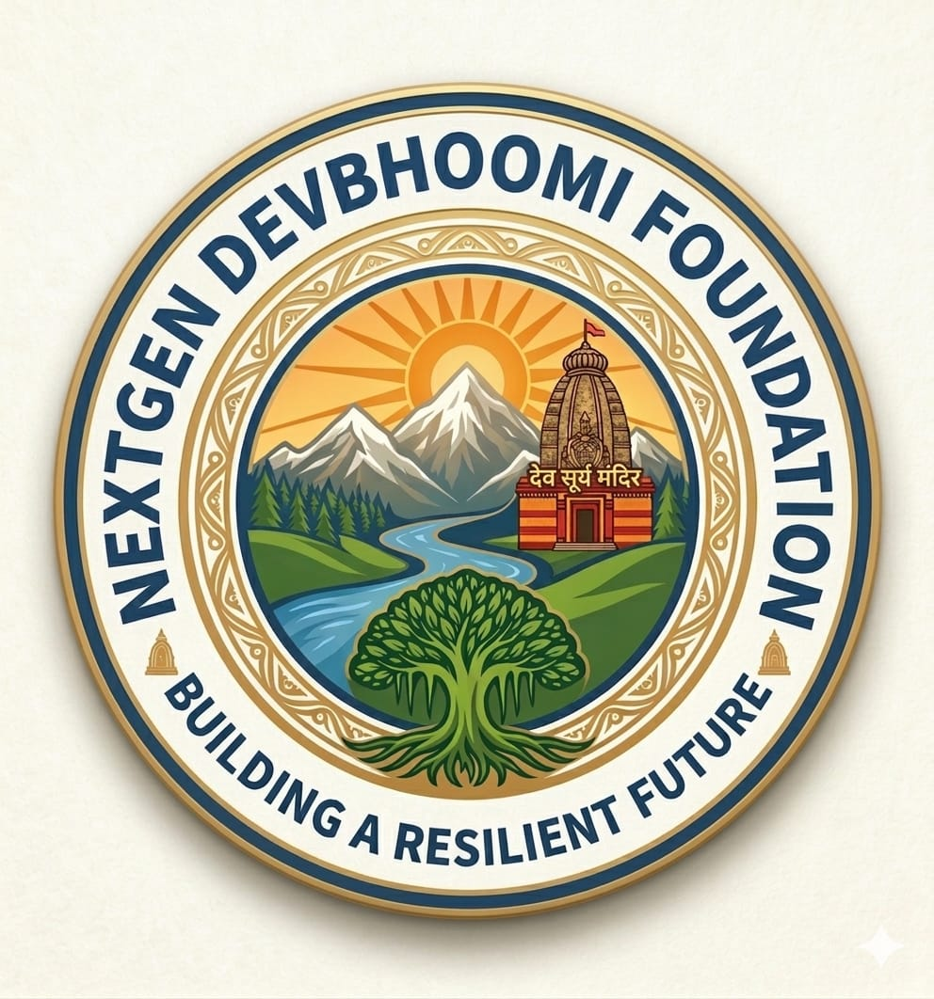

<div align="center">
  
  <h1>NextGen Devbhoomi Foundation</h1>
  <p><strong>Empowering through Education, Community, and Technology</strong></p>

  <p>
    <a href="https://nextjs.org"></a>
    <a href="https://react.dev"></a>
    <a href="https://www.typescriptlang.org"></a>
    <a href="https://tailwindcss.com"></a>
    <a href="https://www.i18next.com"></a>
    
  </p>

  <p>
    <a href="#-overview">Overview</a> •
    <a href="#-features">Features</a> •
    <a href="#-tech-stack">Tech Stack</a> •
    <a href="#-project-structure">Project Structure</a> •
    <a href="#-getting-started">Getting Started</a> •
    <a href="#-environment-variables">Environment Variables</a> •
    <a href="#-available-scripts">Available Scripts</a> •
    <a href="#-contributing">Contributing</a>
  </p>
</div>

---

## 📖 Overview

**NextGen Devbhoomi Foundation** is a full-stack, bilingual (English / हिंदी) NGO + EdTech web platform built to bring world-class technical education and community empowerment to the Himalayan region of Uttarakhand, India.

The platform serves **five distinct user roles** — Students, Volunteers, Donors, Instructors, and Admins — each with a personalized dashboard and access to role-specific workflows.

> Founded in 2022 · Mission: *"To provide accessible, world-class technical education and create a community of empowered developers and social innovators."*

---

## ✨ Features

### 🏠 Public Pages

| Page | Path | Description |
|---|---|---|
| Home | `/` | Hero section, impact stats, programs, testimonials, team, blog, newsletter |
| About | `/about` | Foundation story, vision, mission, leadership |
| Programs | `/programs` | Technical education, community dev, volunteer programs |
| Courses | `/courses` | Filterable course catalogue with pricing, ratings, duration |
| Digital Library | `/library` & `/digital-library` | Curated learning resources repository |
| Blogs | `/blogs` | Articles, updates, and community stories |
| Events | `/events` | Workshops, webinars, field events |
| Gallery | `/gallery` | Photo documentation of field operations |
| Careers | `/careers` | Open roles and internship listings |
| Partner | `/partner` | Partnership inquiry and collaboration |
| Fundraise | `/fundraise` | Crowdfunding and charity campaign pages |
| Donate | `/donate` | Donation form and payment integration |
| Volunteer | `/volunteer` | Volunteer application and program discovery |
| FAQs | `/faqs` | Frequently asked questions |
| Contact | `/contact` | Inquiry form with map and contact details |
| Login | `/login` | Authentication gateway |
| Sitemap | `/sitemap` | Full site navigation map |
| Privacy Policy | `/privacy` | Data handling and privacy details |
| Terms of Service | `/terms` | Platform terms and conditions |
| Refund Policy | `/refund-policy` | Donation and course refund policy |

### 🛠️ Interactive Learning Tools

#### 💻 DSA Problem Solver (`/dsa-solver`)
- Live in-browser coding environment with a **syntax-ready editor** (textarea-based, line-numbered)
- Curated problem library: **Two Sum, Reverse Linked List, Valid Parentheses, Binary Search** (expandable)
- Multi-language templates: **JavaScript (ES6), Python 3, C++ (GCC 14)**
- Simulated **code execution engine** with console output, run/submit states, and toast notifications

#### 📝 Interview Prep Portal (`/interview-prep`)
- Structured question bank across **Frontend, Backend, DSA, and Behavioral/HR** categories
- Animated **expandable accordion** answers with inline code snippets
- Live **search and category filter** for instant lookup
- Built-in prep strategy cards: STAR Method, Explain-First, Clean Code

### 📊 Multi-Role Dashboard (`/dashboard`)
A unified `DashboardLayout` wraps role-specific views with a collapsible sidebar:

| Role | Key Features |
|---|---|
| **Student** | Course progress bars, learning hours, certificates, enrolled courses |
| **Volunteer** | Project tracking, outreach metrics, recognition history |
| **Donor** | Donation history, active fundraisers, impact reports |
| **Instructor** | Course publishing, student management, curriculum scheduling |
| **Admin** | Site-wide analytics, content moderation, user management |

### 🌐 Bilingual Support (i18n)
- **English** (`en`) and **Hindi** (`hi`) with client-side switching via `react-i18next`
- Hydration-safe: default language (`en`) set on init to prevent Next.js SSR mismatch
- All UI strings externalized into `/locales/{lang}/common.json`

### 🎨 Design System
- **Himalayan-inspired color palette**: Deep Blue (`#0B3C5D`), Sacred Orange (`#E58A1F`), Forest Green (`#3F7D3A`)
- **Three-font typographic hierarchy**: Poppins (headings), Inter (body), Cormorant Garamond (accents)
- **8 custom CSS animations**: `fade-up`, `fade-in`, `slide-down`, `slide-up`, `bounce-light`, `float`, `shimmer`, `pulse-soft`
- **Framer Motion** integration for page transitions, scroll-triggered reveals, and micro-interactions
- Scrolling **announcement ticker** and **partners marquee** built with CSS animations
- Fully **dark mode** (`dark` class on `<html>`) with `color-scheme: dark`
- **Mobile-first responsive**: bottom navigation for mobile, slide-in hamburger menu from right

---

## 🧱 Tech Stack

| Category | Technology | Version |
|---|---|---|
| **Framework** | [Next.js](https://nextjs.org) (App Router) | 16.2.6 |
| **UI Library** | [React](https://react.dev) | 19.x |
| **Language** | [TypeScript](https://www.typescriptlang.org) | 5.x |
| **Styling** | [Tailwind CSS](https://tailwindcss.com) | v4 |
| **Animations** | [Framer Motion](https://www.framer.com/motion/) | 12.x |
| **Icons** | [Lucide React](https://lucide.dev) | 1.x |
| **i18n** | [i18next](https://www.i18next.com) + [react-i18next](https://react.i18next.com) | 26.x / 17.x |
| **Notifications** | [Sonner](https://sonner.emilkowal.ski) | 2.x |
| **Theme** | [next-themes](https://github.com/pacocoursey/next-themes) | 0.4.x |
| **Class Utilities** | [clsx](https://github.com/lukeed/clsx) + [tailwind-merge](https://github.com/dcastil/tailwind-merge) + [cva](https://cva.style) | — |
| **Linting** | [ESLint](https://eslint.org) + eslint-config-next | 9.x |

---

## 📁 Project Structure

```
devbhoomi-foundation/
│
├── app/                              # Next.js App Router (all routes live here)
│   ├── layout.tsx                    # Root layout — Navbar, Footer, Providers, Toaster
│   ├── globals.css                   # Global styles + Tailwind directives
│   ├── page.tsx                      # Home page (Hero, Stats, Programs, Blog, etc.)
│   │
│   ├── about/page.tsx                # About Us
│   ├── blogs/page.tsx                # Blog listing
│   ├── careers/page.tsx              # Job/internship listings
│   ├── contact/page.tsx              # Contact form + map
│   ├── courses/page.tsx              # Course catalogue with filters
│   ├── dashboard/page.tsx            # Multi-role dashboard entry
│   ├── digital-library/page.tsx      # Digital resource library
│   ├── donate/page.tsx               # Donation / payment page
│   ├── dsa-solver/page.tsx           # Live DSA coding sandbox
│   ├── events/page.tsx               # Events and workshops
│   ├── faqs/page.tsx                 # FAQs accordion
│   ├── fundraise/page.tsx            # Crowdfunding campaigns
│   ├── gallery/page.tsx              # Photo gallery
│   ├── interview-prep/page.tsx       # Interview Q&A portal
│   ├── library/page.tsx              # Digital library (alternate route)
│   ├── login/page.tsx                # Login / Registration
│   ├── partner/page.tsx              # Partner inquiry
│   ├── privacy/page.tsx              # Privacy policy
│   ├── programs/page.tsx             # Core programs overview
│   ├── refund-policy/page.tsx        # Refund policy
│   ├── sitemap/page.tsx              # Sitemap
│   ├── terms/page.tsx                # Terms of service
│   └── volunteer/page.tsx            # Volunteer sign-up
│
├── components/                       # Shared UI components
│   ├── ui.tsx                        # Atomic components: Card, Badge, Button, Section
│   ├── navbar.tsx                    # Top navigation (desktop dropdown + mobile slide-in)
│   ├── footer.tsx                    # Multi-column site footer
│   ├── bottom-navigation.tsx         # Mobile-only bottom nav bar
│   ├── dashboard.tsx                 # Dashboard layout + role-specific views
│   ├── hero-section.tsx              # Animated hero with image carousel
│   ├── breadcrumbs.tsx               # Route-aware breadcrumb trail
│   ├── language-switcher.tsx         # EN / HI locale toggle
│   ├── coming-soon.tsx               # Coming soon placeholder
│   └── sections.tsx                  # Named section wrappers
│
├── providers/
│   └── language-provider.tsx         # React context for current locale state
│
├── lib/
│   ├── i18n.ts                       # i18next initialisation (en + hi namespaces)
│   └── constants.ts                  # Design tokens, nav links, social links, foundation info
│
├── locales/
│   ├── en/
│   │   └── common.json               # All English UI strings (~55KB)
│   └── hi/
│       └── common.json               # All Hindi UI strings
│
├── public/
│   └── images/
│       ├── devbhoomi-logo.jpeg       # Foundation logo
│       ├── hero-students.png         # Hero section – students
│       ├── hero-mountains.png        # Hero section – mountains
│       ├── hero-mentor.png           # Hero section – mentor
│       ├── gallery-community.png     # Gallery – community
│       ├── gallery-teaching.png      # Gallery – teaching
│       └── gallery-volunteers.png    # Gallery – volunteers
│
├── styles/                           # Additional style modules (if any)
├── hooks/                            # Custom React hooks
├── utils/                            # Utility/helper functions
├── data/                             # Static data files
├── assets/                           # Additional static assets
├── constants/                        # Additional constants
│
├── .env                              # Environment variables (not committed)
├── .gitignore
├── eslint.config.mjs                 # ESLint configuration
├── next.config.ts                    # Next.js configuration
├── tailwind.config.ts                # Extended Tailwind theme (colors, fonts, animations)
├── postcss.config.mjs                # PostCSS configuration
├── tsconfig.json                     # TypeScript configuration
└── package.json                      # Dependencies and scripts
```

---

## 🚀 Getting Started

### Prerequisites

Ensure the following are installed on your machine:

| Tool | Minimum Version | Download |
|---|---|---|
| Node.js | 18.x LTS | [nodejs.org](https://nodejs.org) |
| npm | 9.x | Included with Node.js |
| Git | Latest | [git-scm.com](https://git-scm.com) |

> **Tip:** Use [nvm](https://github.com/nvm-sh/nvm) to manage multiple Node.js versions.

---

### Installation

**1. Clone the repository**

```bash
git clone https://github.com/thedevbhoomifoundation-ops/devbhoomi-foundation.git
cd devbhoomi-foundation
```

**2. Switch to the development branch**

```bash
git checkout develop
```

**3. Install dependencies**

```bash
npm install
```

**4. Set up environment variables**

```bash
cp .env.example .env
```

Then open `.env` and fill in the required values (see [Environment Variables](#-environment-variables)).

**5. Start the development server**

```bash
npm run dev
```

Open [http://localhost:3000](http://localhost:3000) in your browser. The app auto-reloads on file changes.

---

## 🔐 Environment Variables

Create a `.env` file in the root directory. The following variables are supported:

```env
# Application
NEXT_PUBLIC_APP_URL=http://localhost:3000

# API / Backend (add as needed when backend is integrated)
# NEXT_PUBLIC_API_URL=https://api.devbhoomi.org

# Analytics (optional)
# NEXT_PUBLIC_GA_ID=G-XXXXXXXXXX
```

> **Note:** The `.env` file is listed in `.gitignore` and must never be committed. Share secrets through a secure secrets manager (e.g., Vercel environment settings, AWS Secrets Manager).

---

## 📜 Available Scripts

Run the following commands from the project root:

| Command | Description |
|---|---|
| `npm run dev` | Start the Next.js development server at `http://localhost:3000` |
| `npm run build` | Create an optimised production build in `.next/` |
| `npm run start` | Serve the production build locally |
| `npm run lint` | Run ESLint across all `.ts` / `.tsx` files |

---

## 🌿 Branch Strategy

| Branch | Purpose |
|---|---|
| `main` | Stable production-ready code |
| `develop` | Integration branch — all feature branches merge here first |
| `feature/*` | New features (e.g., `feature/payment-integration`) |
| `fix/*` | Bug fixes (e.g., `fix/navbar-scroll`) |
| `features/admin` | Admin panel feature work |
| `features/rebranding` | Brand/UI refresh work |

---

## 🤝 Contributing

We welcome contributions that align with our mission. Please follow the steps below:

**1. Fork the repository and create your branch from `develop`:**

```bash
git checkout develop
git pull origin develop
git checkout -b feature/your-feature-name
```

**2. Make your changes, following the code style:**
- Use TypeScript for all new files
- Keep components small and focused
- Add i18n keys for any new user-facing strings in `locales/en/common.json` and `locales/hi/common.json`
- Follow the existing Tailwind class conventions

**3. Commit with clear, semantic messages:**

```bash
git commit -m "feat: add payment gateway integration"
git commit -m "fix: resolve mobile navbar z-index issue"
git commit -m "docs: update README with new env variables"
```

**4. Push and open a Pull Request targeting `develop`:**

```bash
git push origin feature/your-feature-name
```

Then open a PR on GitHub: [Create Pull Request](https://github.com/thedevbhoomifoundation-ops/devbhoomi-foundation/pull/new/develop)

---

## 🗺️ Roadmap

- [ ] Authentication with JWT / OAuth (Google, GitHub)
- [ ] Backend API integration (Courses, Users, Donations)
- [ ] Payment gateway (Razorpay / Stripe)
- [ ] Admin content management panel
- [ ] Live class / webinar integration
- [ ] Certificate generation system
- [ ] Push notifications
- [ ] Progressive Web App (PWA) support

---

## 📬 Contact & Community

| Channel | Link |
|---|---|
| Email | hello@devbhoomi.org |
| LinkedIn | [nextgen-devbhoomi-foundation](https://www.linkedin.com/company/nextgen-devbhoomi-foundation/) |
| Instagram | [@nextgendevbhoomi](https://www.instagram.com/nextgendevbhoomi/) |
| YouTube | [@devbhoomi](https://youtube.com/@devbhoomi) |

---

## 📄 License

This project is licensed under the **MIT License** — see the [LICENSE](./LICENSE) file for details.

---

<div align="center">
  <sub>Built with ❤️ by the NextGen Devbhoomi Foundation team · Uttarakhand, India 🇮🇳</sub>
</div>
